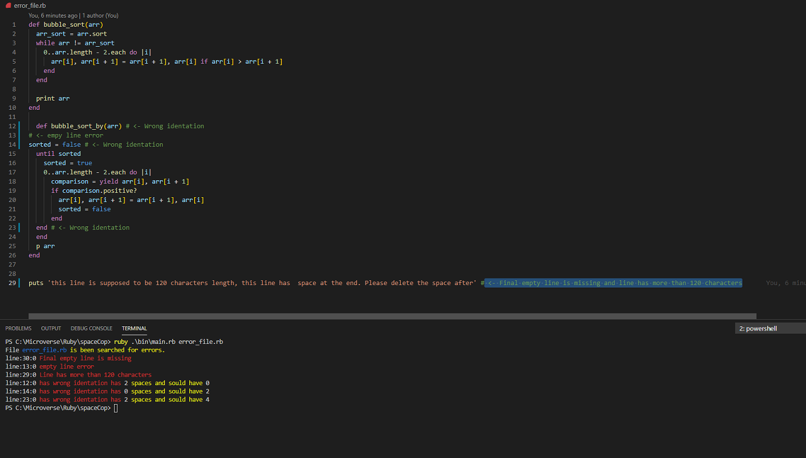
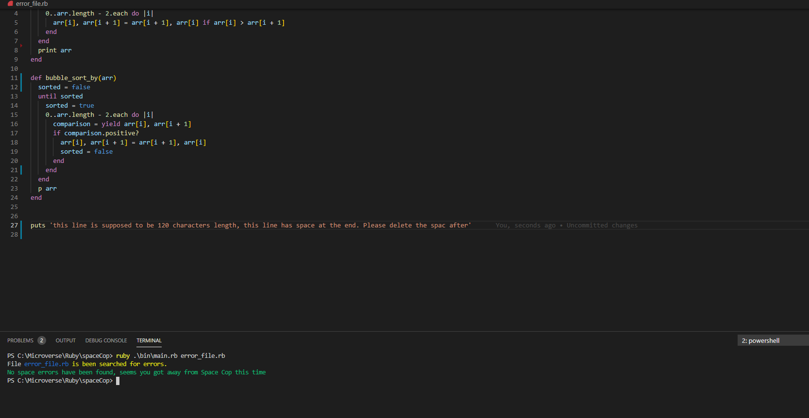

# Space Cop

> This project goal is to create a linter like app on Ruby.

## Built With

- Ruby
- VSC (Code Editor)
- Git and Github

## Getting Started
  
### Prerequisites
  * Ruby installed
  * A GitHub account
  * A terminal to run the code

### Setup
  * Use your GitHub account to clone this repository to your computer.
  * Open the repository files in your terminal. Go to the desired folder and run `` git clone https://github.com/pountzas/spaceCop.git ``
  * Run /bin/main.rb file.

### Testing
  * The Rspec works with the error_file and errors. If it is corrected it will not work
  * Open your terminal
  * To install Rspec, run the following command into your terminal: </br>
  ``` gem install rspec ```
  * Go to your local project repository with the cd command.
  * To run the test examples, run the following command into your terminal: </br>
``` rspec ```

## Documentation
Here i present good and bad practices.
### Information
* To run the code open your terminal
* ``` ruby .\bin\main.rb error_file.rb ```

``` Bad Practise ```


``` Good Practise ```

  
## Authors

👤 **Nikos Pountzas**

- GitHub: [@pountzas](https://github.com/pountzas)
- Twitter: [@pountzas20](https://twitter.com/pountzas20)
- LinkedIn: [LinkedIn](https://www.linkedin.com/in/nikos-pountzas/)


## 🤝 Contributing

Contributions, issues, and feature requests are welcome!

Feel free to check the [issues page](https://github.com/pountzas/spaceCop/issues).

## Show your support

Give a ⭐️ if you like this project!

## 📝 License

This project is [MIT](MIT.md) licensed.
